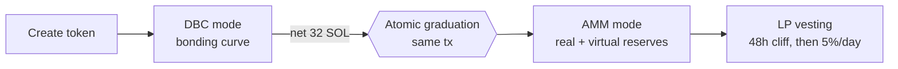

# YeetLaunch — powered by YeetAMM

**A Solana-native token launch protocol with a fully self-contained liquidity stack.**

Native dynamic bonding curve · native AMM · native aggregator & indexer · fixed-fee execution · vesting-backed post-graduation liquidity

---

## What it is

YeetLaunch lets anyone launch a token on a bonding curve in minutes. When the curve fills, the token **graduates atomically** into a YeetAMM pool — no waiting, no separate migration, no external DEX. The whole lifecycle — price discovery, graduation, market-making, LP vesting — runs on one audited on-chain program plus a native aggregator and indexer. Nothing routes through third-party venues.

The design goal is **legibility**: fees you can reason about, liquidity you can trust after graduation, and anti-dump mechanics that are documented in the open rather than hidden.

## How it works

A token lives in one program, in two phases on the same pool account:

1. **DBC mode (launch curve).** Price discovery via virtual reserves. Flat 1.00% fee.
2. **Graduation.** When the pool's quote reserve reaches **32 SOL of net trader contribution** (sells subtract — round-trips don't count), the *same transaction that crosses the threshold* flips the pool from DBC → AMM in place. Real reserves carry over intact; virtual reserves are **preserved as decay anchors** so the first AMM spot price exactly equals the final curve price.
3. **AMM mode.** Standard constant-product execution over real + (decaying) virtual reserves, with LP retained in-pool to grow the invariant.

## Fees

Flat **1.00% per swap**, from the first trade, enforced on-chain. Only the split changes at graduation — the creator's cut never does.

| Mode | Total | YeetLaunch | Creator | LP (stays in pool) |
|------|:-----:|:----------:|:-------:|:------------------:|
| **DBC** (pre-grad) | 1.00% | 0.70% | 0.30% | 0.00% |
| **AMM** (post-grad) | 1.00% | 0.50% | 0.30% | 0.20% |

Creators earn **0.30% of every swap for the life of the token**, in both modes, plus daily LP-value payouts after graduation.

## Anti-dump, in the open

Sell restrictions are the single most honeypot-associated mechanic in the space, so YeetLaunch documents them loudly instead of hiding them. Post-graduation, four layers work together — and **buys are never restricted**:

- **Per-slot hard cap** — at most **5% of reserves** can be sold per slot (aggregate across all wallets); cumulative per-slot accounting closes the multi-wallet same-slot bypass.
- **Adaptive decaying bucket** — a per-transaction cap that draws down on sells and recovers over time, with a 0.5% floor always available.
- **Virtual-reserve decay** — depth decays from its full anchor to a permanent **15% floor over ~6 hours**, eliminating graduation-crossing round-trip arbitrage.
- **LP lock & vesting** — **30% of LP is permanently locked**; the remaining 70% vests to the creator over a **48-hour cliff, then 5%/day** to day 16.

The result: a large holder cannot crater the floor in a single transaction; exits are forced to slow-roll at declining, fully-visible prices. See §7.6 of the whitepaper for the full honeypot distinction and comparison table.

## Documentation

| Document | Description |
|----------|-------------|
| **[Whitepaper (PDF, v1.4)](docs/YeetLaunch_Whitepaper_v1.4.pdf)** | The complete protocol design: DBC math, graduation, fee model, anti-dump, LP vesting, and assurance results. |
| [Whitepaper (Markdown)](docs/YEETLAUNCH_POWERED_BY_YEETAMM_WHITEPAPER.md) | Same content, readable on GitHub. |
| [YeetAMM Routing & Integration Guide](docs/YEETAMM_ROUTING_INTEGRATION.md) | For external aggregators/routers: program IDs, pool-state layout, the fee model, how to quote (API / on-chain simulation / executed trades), and how to respect the per-slot sell cap. |
| [YeetAMM TypeScript SDK](yeet-amm-sdk/) | Thin client for wallets, bots, and trackers: PDA derivation, swap instruction builders, account/error decoding, decimal helpers, and a REST client. Turnkey buy/sell with automatic wSOL wrap/unwrap. |

## At a glance

- **Graduation threshold:** 32 SOL of net contribution (≈ deliberately small so tokens can realistically graduate)
- **Token creation:** 0.03 SOL
- **Graduation:** atomic, in-place DBC → AMM
- **Post-grad liquidity:** 30% permanently locked, 70% creator-vesting (48h cliff → 5%/day)
- **Stack:** 100% Yeet-native — DBC, AMM, aggregator, and indexer are all first-party

---

**[yeetlaunch.io](https://yeetlaunch.io)**

*The source code for the protocol and platform is proprietary. This repository contains public documentation only.*

