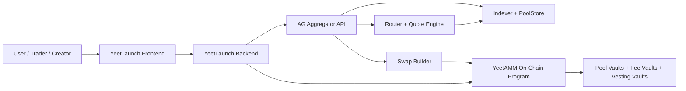
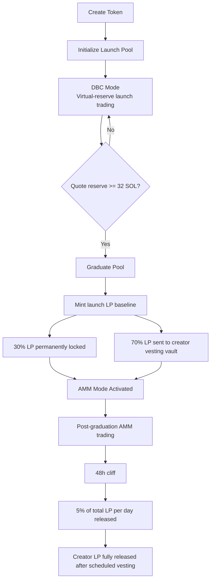
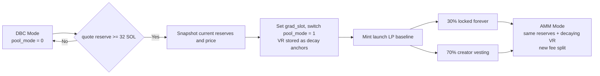
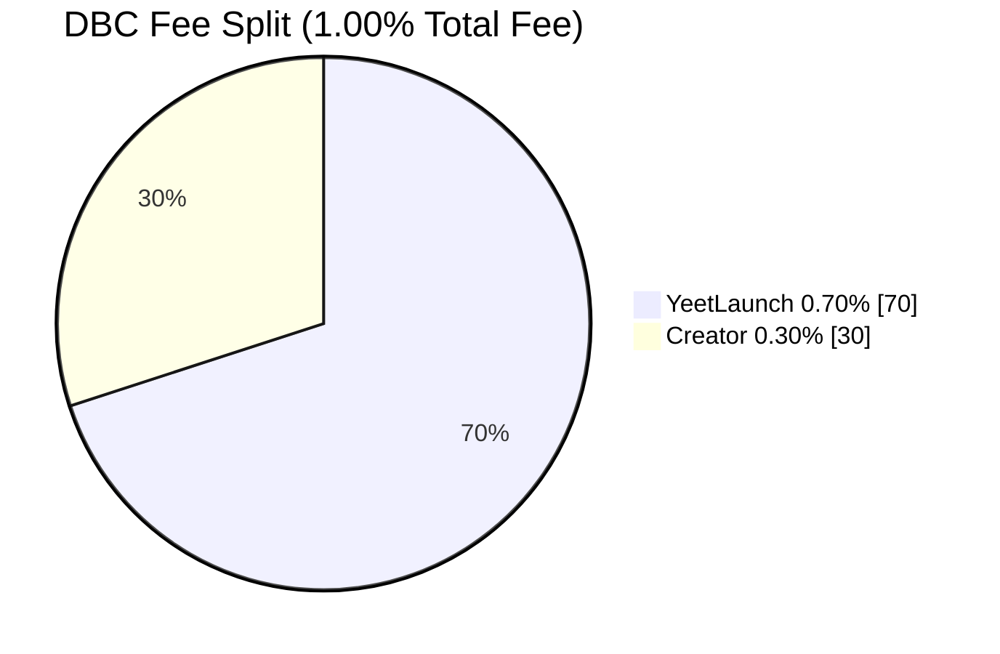
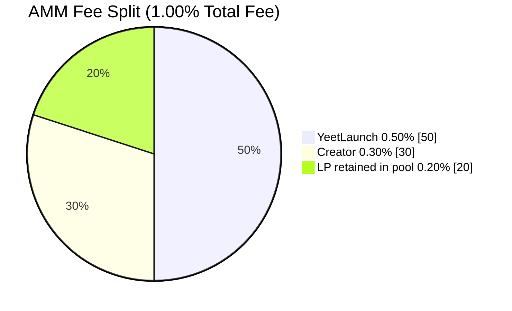
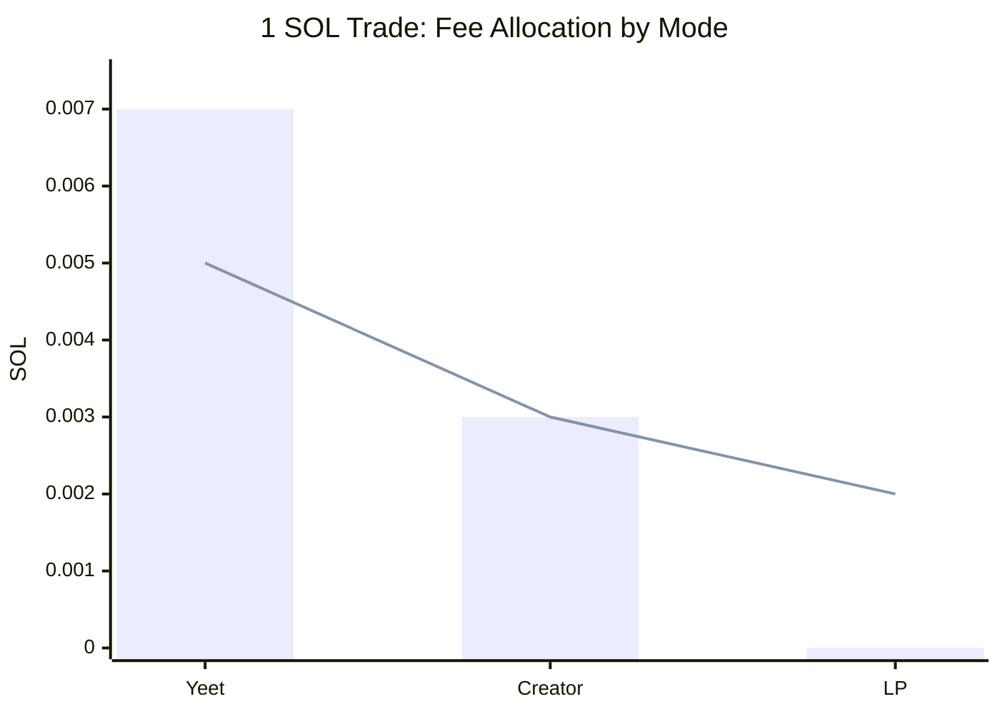
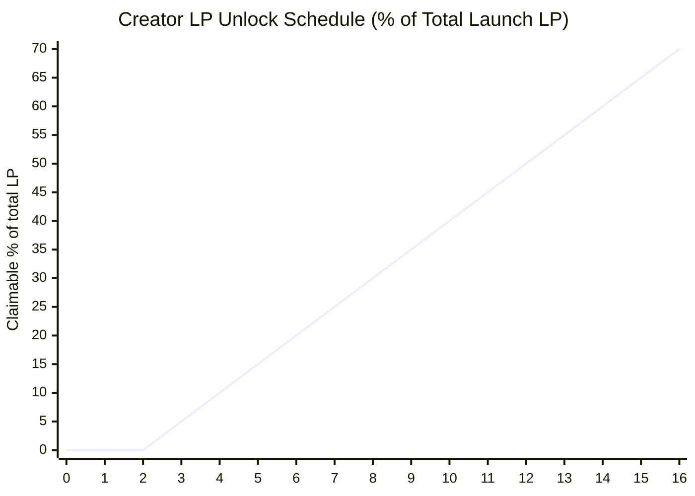

# YeetLaunch powered by YeetAMM
## Production Whitepaper

**Version:** 1.4 (rev. 2026-07-10)  
**Date:** 2026-07-10  
**System:** Solana launchpad + AMM lifecycle stack  
**Evidence Base:** April 2026 internal code review and adversarial QA, June 2026 adversarial QA review, on-chain math review, deterministic simulations, current native-stack source review, targeted protocol tests, and a July 2026 full-lifecycle execution against the deployed program bytecode (in-SVM through day-16 LP vesting) plus a live-devnet mint→graduation on the same deployed program

---

## Abstract

YeetLaunch is a Solana-native token launch protocol designed to address a recurring failure pattern in memecoin and community-token markets: launch mechanics are often simple, but incentive alignment is weak, post-graduation liquidity is fragile, fee structures are difficult to reason about, and creators and traders operate under opaque assumptions. YeetLaunch addresses that gap by combining a deterministic launch phase with an AMM execution layer, YeetAMM, that was audited and verified before release.

The system has two operating phases. In **DBC mode**, a token starts on a launch curve that uses virtual reserves for price discovery and charges a fixed 1.00% total fee. That fee is split exactly **70 bps to YeetLaunch** and **30 bps to the token creator**, with **no LP allocation**. When the pool’s quote reserve reaches the **32 SOL graduation threshold**, the pool transitions into **AMM mode** without rebuilding the market: all real reserves carry over intact, and virtual reserves are **preserved as decay anchors** to ensure exact price continuity at the boundary. Post-graduation, the effective virtual reserves decay linearly from their full anchor values to a permanent 15% floor over approximately 6 hours (54,000 slots), then are held at that floor indefinitely. This eliminates the graduation-crossing round-trip arbitrage that existed when virtual reserves were zeroed, while providing ~1.15× deeper liquidity than a pure CPMM permanently. In AMM mode, the total fee remains **1.00%**, but the split changes to **50 bps to YeetLaunch**, **30 bps to the creator**, and **20 bps retained in pool reserves** to increase liquidity depth and grow the invariant.

This lifecycle runs on YeetLaunch’s own stack: its own DBC logic inside YeetAMM, its own AG aggregator and indexer, and its own YeetAMM pools as the canonical launch and post-graduation venue. External venue adapters exist inside AG for comparison and future expansion, but the YeetLaunch launch lifecycle does not depend on a third-party DBC, third-party indexer, third-party aggregator, or third-party AMM pool.

An internal code review and adversarial QA session in April 2026 identified and fixed fee-table and off-chain synchronization defects before release. After remediation, the protocol passed targeted on-chain and TypeScript verification, a **1,000-pool / 10,420-swap** readiness simulation with **0 mismatches, 0 invariant violations, and 0 stuck pools**, and adversarial QA re-verification with **87 Rust unit tests**, **302 Vitest checks**, and **13 adversarial QA evidence proofs** (including the key regression guard `qa_evidence_12_production_decay_risk_free_roundtrip_negative`) passing against the current repository state. In July 2026 the complete token lifecycle — mint → DBC → graduation → post-cliff LP vesting — was additionally executed end-to-end against the **deployed program bytecode**, with the day-16 vesting mark reached in an in-process Solana VM (the LP schedule is fixed in the program and cannot be reached in wall-clock time), and a **live-devnet** launch was carried through graduation on that same deployed program. This whitepaper describes the design, economics, safety model, lifecycle, and operational implications of that verified state.

---

## Table of Contents

1. Executive Summary  
2. The Problem with Current Launchpads  
3. System Overview  
4. Token Lifecycle  
5. Bonding Curve Mechanics  
6. Graduation Mechanism  
7. AMM Design  
8. Fee Model Deep Dive  
9. Liquidity and Vesting Model  
10. Security Model  
11. Simulation and Testing Results  
12. Economic Design  
13. Comparison with Pump.fun and Raydium  
14. Risks and Considerations  
15. Future Roadmap  
16. Conclusion  
17. Appendix A: Core Formulas  
18. Appendix B: Audit Findings Incorporated into Release  
19. Appendix C: Source Basis and References

---

# 1. Executive Summary

YeetLaunch is a launchpad built for one narrow objective: make token launches easier to reason about after the first day of hype. The system treats launch, graduation, liquidity formation, and post-launch trading as one continuous financial lifecycle rather than a chain of loosely connected products. That design choice matters. In many launch stacks, creators earn something during the curve phase, traders face changing fee surfaces, and liquidity after migration is either too thin, too discretionary, or too easy to abandon. YeetLaunch instead anchors the lifecycle to a single execution philosophy: deterministic pricing rules, mode-specific fee schedules, transparent value flow, and explicit post-graduation lock and vesting constraints.

| Core fact | Verified production value |
|---|---:|
| DBC total fee | 1.00% |
| DBC split | 0.70% Yeet / 0.30% Creator / 0.00% LP |
| AMM total fee | 1.00% |
| AMM split | 0.50% Yeet / 0.30% Creator / 0.20% LP |
| Graduation threshold | 32 SOL |
| Permanent LP lock | 30% |
| Creator LP vesting | 70% |
| Vesting cadence | 48h cliff, then 5% of total LP per day |
| Post-graduation sell cap | ≤5% of reserves per slot, adaptive down to a 0.5% floor |

At launch, a token enters **DBC mode**, where the protocol uses a virtual-reserve bonding-curve style CPMM to discover price and gather quote-side liquidity. Fees are fixed and simple: **1% total**, split **70% to YeetLaunch** and **30% to the creator**, with **0% to LP** because there is no public LP entitlement during the launch phase. This preserves clarity. During the launch phase no portion of fees is set aside into a separate LP claim system, so the fee a trader pays maps directly to platform and creator economics, and creators participate in economic upside from the first trade.

At the moment the pool’s quote reserve reaches **32 SOL**, the system graduates the pool into **AMM mode**. Graduation is not a relaunch. It is a mode switch that carries all real reserves forward without rebuilding the market. Virtual reserves are **preserved as decay anchors**: at `grad_slot` (elapsed = 0) the effective virtual reserves equal the full anchor, so the graduation price step is exactly **1.0×** — there is no price discontinuity. Post-graduation, the effective virtual reserves decay linearly to a 15% permanent floor over ~6 hours (54,000 slots), providing ~1.15× deeper liquidity than a pure CPMM permanently and eliminating the graduation round-trip arbitrage that existed when virtual reserves were zeroed. The fee schedule changes to one appropriate for persistent liquidity: **1% total**, split **0.50% to YeetLaunch**, **0.30% to the creator**, and **0.20% retained in the pool**. That retained LP fee increases reserves, deepens liquidity over time, and mechanically supports the invariant rather than routing all economics externally.

The post-graduation LP model is equally explicit. Newly minted LP exposure is split **30% permanently locked** and **70% assigned to creator vesting**. The creator portion is subject to a **48-hour cliff** and then unlocks at **5% of total launch LP per day** for **14 days total**. This structure keeps creators economically involved while sharply reducing immediate rug incentives. It does not eliminate market risk; it reduces one of the most common forms of launch-stage extraction.

One post-graduation control deserves explicit, up-front mention because it is the single mechanic most associated with scams: **sell rate-limiting.** In AMM mode YeetAMM caps how much of a pool’s reserves can be sold per slot (5%) and adapts a per-pool sell allowance downward to a 0.5% floor under sustained pressure, so that no single actor — or coordinated group of wallets — can drain a freshly graduated pool in one block. This is deliberately **not a honeypot, and the distinction is exact:** buys are never limited, there is no per-address blocklist or allowlist, the identical limit applies to the creator and team, a rejected sell reverts **without moving any funds**, and sell capacity always refills automatically — there is no state in which selling is disabled. Because an *undocumented* sell restriction is indistinguishable from a trap, the precise rule, the constants, what a trader sees if a sell is rejected, and a line-by-line honeypot comparison are published in **§7.6** — and traders should expect to see them enforced.

The system is also designed to survive scrutiny. Internal adversarial QA in April 2026 found concrete defects: fee tables were wrong, backend quote math diverged on dust trades, a live swap builder omitted a required fee vault account, and DBC/AMM representation off-chain was incomplete. Those issues were fixed, and the codebase was re-tested. The verified result is a launchpad + AMM stack that is materially easier to reason about than systems that rely on dynamic fee ladders, additive fee stacking, or loosely documented migration logic. An independent external audit has not yet been completed; see Section 15.4.

YeetLaunch exists because launch infrastructure should be legible to three groups at once:

- **Developers** need deterministic mechanics they can integrate against.
- **Traders** need to understand what is taken from their input and why.
- **Investors and creators** need to know whether post-launch liquidity is durable or cosmetic.

The rest of this document explains how the system achieves that.

---

# 2. The Problem with Current Launchpads

The memecoin and community-token market has converged on a familiar launch template: low-friction token creation, bonding-curve price discovery, and migration into a post-launch trading venue. That template works for distribution, but it often fails as financial infrastructure. The problem is not that these systems are too simple. The problem is that the most important economic assumptions are often fragmented across products, dashboards, and external docs.

## 2.1 Fee opacity and additive cost stacking

One of the most common failures in launch design is that users see a single percentage in the UI but pay for several layered mechanisms in practice. Current launch platforms frequently combine protocol fees, creator fees, platform fees, referral fees, and post-migration creator overrides. In some systems, the total effective fee changes by phase or by market-cap band. In others, creator fees are additive to trade fees rather than carved from them. This matters because it changes execution quality, trader break-even thresholds, and the sustainability of a token’s order flow.

YeetLaunch takes the opposite position. Its total fee is **always 1.00%** in both modes. The total never drifts because of stacked creator charges, referral overlays, or market-cap schedule changes. Only the internal split changes by phase.

## 2.2 Poor liquidity quality at graduation

Graduation is the most fragile moment in a launch lifecycle. In many systems, price discovery happens in one venue and liquidity lives elsewhere after migration. That creates discontinuity risk: reserves can be reconstituted with different economics, price can jump due to reinitialization, and users can end up trading a different market than the one they helped form.

YeetLaunch was built around a different requirement: **no price reset at graduation**. The internally verified lifecycle confirms reserve continuity and price continuity across the DBC to AMM transition. Graduation is meant to feel like a phase change, not a market replacement.

## 2.3 Creator misalignment

Launchpads often oscillate between two bad extremes. In one extreme, creators receive too little economic upside and quickly disengage. In the other, creators receive large discretionary control over immediate liquidity and can extract value faster than the community can react. Neither structure produces durable markets.

YeetLaunch solves this with a split model:

- creators earn from the first trade,
- creators continue earning after graduation,
- creators receive vested LP exposure rather than immediate unrestricted liquidity,
- a permanent lock ensures some liquidity is never withdrawn.

This is not a moral argument about creator behavior. It is a market-structure argument: if a token’s long-term trading venue can be stripped too quickly, traders rationally discount it.

## 2.4 Hidden mechanics and rounding drift

Many launch systems publish high-level formulas but leave the most consequential edge behavior undocumented: dust fees, exact-output rounding, quote drift between backend and on-chain execution, fee vault routing, and the precise treatment of liquidity-retained fees. Those details are where user trust usually breaks.

The April 2, 2026 audit of YeetAMM explicitly targeted these issues. The final production state now enforces:

- **output amounts use floor**,  
- **required inputs for exact-output use ceiling**,  
- **backend split logic mirrors on-chain math exactly**,  
- **no stale DBC creator-share field leaks into AMM mode**,  
- **LP fee remains in reserves rather than flowing to a separate LP fee vault**.

That kind of precision is the difference between a whitepaper model and a production financial system.

---

# 3. System Overview

YeetLaunch is the user-facing launchpad. YeetAMM is the execution and post-graduation liquidity layer. Around them sits an internal routing and indexing stack that makes the system operable at production latency.

## 3.1 Functional layers

### YeetLaunch

YeetLaunch is responsible for token creation, launch initialization, lifecycle orchestration, and user-facing product flow. It owns the launch experience: token creation, launch activation, graduation monitoring, and post-graduation vesting and fee visibility.

### YeetAMM

YeetAMM is the on-chain liquidity engine. It stores the pool state, vaults, virtual reserves, fee vaults, LP accounting, lock and vesting state, and the current mode flag (`DBC` or `AMM`). It is the authoritative source of pricing and fee settlement.

### AG Aggregator

The AG routing stack acts as the execution coordinator for the frontend and backend. It indexes pools, builds best paths, rejects stale pool state, and constructs ready-to-sign swap transactions. In the YeetLaunch deployment, AG live-indexes YeetAMM pools and serves YeetLaunch order flow through the native Yeet stack. AG supports broader venue adapters as optional infrastructure, but YeetLaunch launch and post-graduation trading do not require third-party DBCs, third-party indexers, or third-party AMM pools.

## 3.2 Architecture diagram



## 3.3 Operating principles

The system is built around five principles:

1. **Single-state lifecycle:** launch and AMM phases share reserve continuity.  
2. **Fixed total fee surface:** total user fee is 1.00% in both modes.  
3. **Mode-based accounting:** fee logic switches by `pool_mode`, not by legacy pool fields.  
4. **Liquidity retention by design:** AMM LP fee stays in the pool and grows `k`.  
5. **Auditability over optionality:** predictable mechanics are preferred to flexible but opaque fee ladders.

---

# 4. Token Lifecycle

The token lifecycle is where YeetLaunch departs from launch systems that treat creation, discovery, and post-launch trading as separate products. In YeetLaunch, the lifecycle is one continuous state machine.

## 4.1 Lifecycle flowchart



## 4.2 Lifecycle phases

### Phase 1: Creation

The creator initializes a token and its launch pool. At this point the system creates the pool state, vault relationships, graduation threshold, and launch-specific accounting fields. Creation is the point at which economic rules become immutable enough to matter; if fee logic or vesting rules are malleable after this stage, traders are effectively underwriting governance risk rather than market risk.

### Phase 2: DBC mode

The token begins trading against quote-side liquidity using virtual-reserve CPMM math. There is no LP reward bucket in this phase. The purpose of DBC mode is price discovery and liquidity accumulation, not immediate LP monetization.

### Phase 3: Graduation

When the pool’s quote reserve reaches the configured threshold of **32 SOL**, the pool graduates. Graduation flips the `pool_mode`, sets `grad_slot` metadata, establishes lock and vesting schedules, and activates AMM fee logic. Virtual reserves are preserved as decay anchors — at `grad_slot` the effective virtual reserves equal the full anchor, ensuring exact price continuity (1.0× step). They then decay to a 15% permanent floor over ~6 hours.

### Phase 4: AMM mode

After graduation, trading continues in YeetAMM with the AMM fee model. LP value begins to accrue through the **20 bps LP-retained fee bucket**, and the pool becomes a durable post-launch market instead of a temporary launch mechanism.

### Phase 5: Vesting completion

The creator’s LP share is time-released rather than immediately withdrawable. That means the market has a window in which liquidity remains partially committed, and the creator’s upside is linked to the token’s ability to survive beyond the first burst of attention.

## 4.3 Why this lifecycle matters

The lifecycle is engineered to answer a question most launchpads avoid: who still has skin in the game after the launch narrative ends? In YeetLaunch, the answer is explicit:

- the platform keeps a long-term stake in order flow,
- the creator participates economically over time,
- liquidity is partially permanent,
- and the pool itself deepens as AMM trading continues.

That is a stronger basis for sustained trading than a model that depends on purely social promises.

---

# 5. Bonding Curve Mechanics

DBC mode is the launch engine. It uses virtual-reserve constant-product math to create smoother price discovery while keeping real reserve accounting strict.

## 5.1 Pricing model

YeetAMM computes launch-phase swaps using the effective invariant:

`(reserve_in + virtual_in) × (reserve_out + virtual_out) = k`

For an exact-input swap:

1. Fee is applied to the raw input.  
2. The post-fee input is inserted into the effective reserve curve.  
3. Output is floored.  
4. Output must remain strictly below the real reserve balance.

This design matters because virtual reserves shape price response without creating withdrawable phantom assets. They influence pricing, not custody.

## 5.2 DBC fee extraction

DBC mode uses the simplest fee surface in the system:

| Metric | Value |
|---|---:|
| Total fee | 1.00% |
| YeetLaunch share | 0.70% |
| Creator share | 0.30% |
| LP share | 0.00% |

In other words, the full fee is externalized to platform and creator economics. Nothing is withheld for LP because public LP ownership is not the purpose of DBC mode.

## 5.3 Why no LP exists in DBC mode

The absence of an LP fee bucket in DBC mode is deliberate. Pre-graduation trading is not intended to support a class of discretionary liquidity providers whose incentives may diverge from launch participants. If LP economics are introduced too early, the launch phase becomes harder to reason about because volume begins serving two goals at once: price discovery and LP yield production.

By removing LP fee extraction during DBC mode, YeetLaunch keeps the launch phase legible:

- creators know exactly what they earn,  
- the platform knows exactly what sustains distribution,  
- traders know the total fee burden and can model it directly.

## 5.4 Economic implications

DBC mode is optimized for initialization, not permanence. That means:

- slippage behavior reflects both real and virtual reserves,  
- creator incentives begin immediately,  
- pool economics remain transparent,  
- and the market is pushed toward graduation rather than indefinite pre-graduation farming.

This is a more honest framing of a launch curve. It is a discovery market with explicit monetization, not a disguised LP venue.

---

# 6. Graduation Mechanism

Graduation is the handoff from discovery to permanence. In YeetLaunch, it is implemented as a state transition, not a discontinuous migration that rebuilds the market from scratch.

## 6.1 Threshold logic

The graduation trigger is the pool’s quote reserve reaching **32 SOL**. The pool stores the canonical quote mint and uses the reserve associated with that quote mint for threshold checks. This is important because a multi-asset pool should not depend on ambiguous “total liquidity” heuristics when deciding whether it is ready for AMM mode.

The check reads the pool’s **real** quote reserve, not cumulative trading volume. That makes graduation an inherently **net** measure: a buy adds to the reserve and a sell removes from it, so wash-trading the same SOL back and forth does not move a token toward graduation. Only SOL that traders actually leave in the curve counts. This is what lets the threshold double as a Sybil- and bot-resistance property — manufacturing volume without committing real, retained capital achieves nothing (see §6.6 and §10.9).

## 6.2 Reserve and price continuity at graduation

Graduation is a mode switch, not a migration. All real reserves carry forward intact. Critically, **virtual reserves are also preserved** at graduation rather than zeroed: the values stored in `virtual_reserve_a` and `virtual_reserve_b` become permanent decay anchors. At `grad_slot` (elapsed = 0), the effective virtual reserves equal the full anchor, so the first post-graduation price is mathematically identical to the final DBC marginal price — the graduation step is exactly **1.0×**. This closes the round-trip arbitrage that previously existed when virtual reserves were zeroed at graduation.

Post-graduation, the effective virtual reserves decay according to the following schedule:

- **elapsed ∈ [0, 54,000 slots]**: effective value decreases linearly from the full anchor to 15% of the anchor (the permanent floor). 54,000 slots is approximately 6 hours at Solana's ~400ms slot time.
- **elapsed > 54,000 slots**: effective value is held at the 15% floor permanently.

This decay is computed lazily at read time using `Pool::effective_virtual_reserves(current_slot)`. The stored anchor values are never mutated after graduation — only the read-time projection changes. This preserves invariant accounting and requires no migration for existing pools.

The practical effects of the 15% permanent floor are:

- pool depth remains ~1.15× that of a pure CPMM permanently,
- volume required to move price ±25% is ~4.49 SOL (vs 3.84 SOL for pure CPMM),
- LP earnings per unit price move are ~1.17× higher than pure CPMM,
- the graduation crossing round-trip profit is −0.0002 SOL (net loss) rather than +2.13 SOL.

## 6.3 Transition diagram



## 6.4 Launch LP issuance

At graduation, LP is minted against the launch liquidity baseline. Distribution is deterministic:

| LP bucket | Share | Treatment |
|---|---:|---|
| Permanent lock | 30% | Never withdrawable |
| Creator vesting | 70% | 48h cliff, then 5% of total LP per day |

The protocol also preserves a minimum-liquidity dust buffer in LP accounting, which is standard practice for preventing pathological edge behavior in LP supply.

## 6.5 Why this graduation model is safer

A launch system becomes structurally weak if graduation creates a new market with a new fee surface, new counterparty assumptions, and a relocated venue. YeetLaunch’s audited graduation model avoids that. The market that discovered the launch price is the market that becomes the AMM — the same pool, the same real reserves, the same venue — with a different fee distribution, new LP semantics, and virtual reserves preserved as decay anchors to guarantee price continuity at the boundary.

The June 2026 adversarial QA review confirmed that the previous design (zeroing virtual reserves at graduation) created a structurally profitable graduation-crossing round-trip: a 5-SOL buy crossing the threshold could return +2.13 SOL profit by selling immediately after graduation, because the V1 absolute virtual-reserve profile (22 SOL quote / 300M base) was larger than the depleted real reserves at graduation, causing an upward price jump when zeroed. The decay model eliminates this by ensuring effective virtual reserves equal the full anchor at `grad_slot` (elapsed = 0), making the graduation step exactly 1.0×. The risk-free 1-slot round-trip is now −0.0002 SOL.

## 6.6 Why the threshold is set at 32 SOL

The 32 SOL threshold is a deliberate accessibility decision, not an arbitrary constant. Graduation depth is a trade-off: set it too high and graduation becomes the exclusive preserve of tokens backed by a large pre-existing audience or automated volume — the dynamic that makes most launchpads feel structurally rigged against ordinary creators — while setting it too low graduates pools with liquidity too thin to sustain a real market.

32 SOL — on the order of **$2,600 at recent SOL prices** (the figure scales with the SOL price) — is calibrated against the first failure mode. It is a target a genuine, engaged community can reach through ordinary organic trading, without needing to know tens of thousands of people or run a wash-trading bot to manufacture depth. Crucially, because the threshold is measured against the pool's **real** quote reserve — the actual SOL traders have committed to the curve, not gross volume and not the price-shaping virtual reserves — the 32 SOL represents genuine, retained trader contribution. Round-tripping the same capital does not advance a token toward graduation (§6.1, §10.9); the SOL has to stay in.

The intent is explicit: most serious launches should be *able* to graduate on merit, rather than graduation being a rare outcome reserved for the well-connected or the well-botted. The threshold is a protocol parameter, and the surrounding launch economic policy (initial virtual reserves, supply, decimals) is described in §12.

---

# 7. AMM Design

YeetAMM is the persistent trading venue after graduation. It uses constant-product reserve accounting with explicit fee retention and invariant protection.

## 7.1 Core invariant

The pool follows the standard CPMM relationship:

`x × y = k`

In practice, when virtual reserves are active, the effective invariant is evaluated as:

`(x + v_x) × (y + v_y) = k`

In DBC mode, `v_x` and `v_y` are the full anchor values set at initialization. Post-graduation, `v_x` and `v_y` are the **effective virtual reserves** computed lazily at swap time: they decay from the full anchor to a 15% permanent floor over 54,000 slots (~6 hours) and are held at the floor thereafter. The stored anchor values in `virtual_reserve_a/b` are never mutated — only the read-time projection changes, so the invariant accounting remains sound.

What matters is not the symbolic formula alone, but how the implementation applies it:

- exact-input output is floored,
- exact-output input is ceiled,
- output cannot drain the real reserve to zero,
- and retained LP fee causes `k` to grow over time after graduation.

## 7.2 AMM fee distribution

AMM mode is where the system begins paying the pool itself:

| Metric | Value |
|---|---:|
| Total fee | 1.00% |
| YeetLaunch share | 0.50% |
| Creator share | 0.30% |
| LP share retained in reserves | 0.20% |

The fee split is mode-based and explicit. Internal adversarial QA confirmed that the legacy `creator_fee_share_bps` field is no longer authoritative and is not used for AMM fee execution.

## 7.3 LP fee retention and invariant growth

The AMM does not send LP fees to a separate claim vault. Instead, the **20 bps LP fee remains in pool reserves**. Because the retained fee is added to a reserve without minting offsetting LP supply, it raises the constant-product invariant exactly: with reserves `x` and `y` and `k = x·y`, adding `δ` to one reserve yields a new invariant `(x + δ)·y = k + δ·y > k`. The effect is therefore mechanical, not merely operational:

1. it increases `k` on every AMM-mode trade that pays the LP fee, and  
2. it raises the redeemable value of each LP unit without a separate fee-distribution path.

There is therefore **no LP fee vault** in the production design. LP value accrues through reserve growth, not through a parallel sweep account.

This is materially cleaner than an architecture that fractures value between swap settlement and a parallel LP fee accounting system.

## 7.4 Quote determinism

The AG router uses the same constant-product quote logic as the on-chain program. One of the defects found in the April 2026 internal review was synthetic minimum-fee behavior off-chain, which caused dust-size quote drift. That was removed. The codebase now mirrors on-chain floor math exactly, which is essential for reliable routing and accurate price previews.

## 7.5 Execution controls

AMM swaps enforce:

- input and output mint validation,  
- deterministic fee-vault derivation,  
- slippage checks,  
- deadline slots for stale transaction protection,  
- and invariant assertions around launch-pool state.

The result is not merely “an AMM.” It is a launch-aware AMM with fixed phase semantics.

---

## 7.6 Sell rate-limiting — and why it is not a honeypot

This section documents a mechanic that a legible protocol must never leave to be discovered by surprise. **In AMM mode, an unusually large or fast sell can be rejected on-chain and must be resized or retried.** That behavior, undocumented, is indistinguishable from a honeypot — so it is documented here in full, with the exact rule, the exact numbers, what a trader experiences, and a point-by-point comparison against an actual honeypot. YeetAMM rate-limits sell *velocity*; it never blocks selling, never targets anyone, and never takes funds.

### 7.6.1 The rule

After graduation (`pool_mode == AMM`), every sell of the launch token into the quote asset (token → SOL) is checked against two independent limits. Buys are never limited — you can always enter. DBC-mode selling is not limited here either; on the curve, full fee extraction already makes round-trips unprofitable. Both limits are expressed in basis points of the token reserve the trade consumes, `consumed_bps = ceil(amount_in × 10_000 / reserve_in)`, which makes them **scale-invariant** — identical behavior on a small pool or a large one.

1. **Hard per-slot cap.** At most **5% of the reserve** (`PER_SLOT_SELL_CAP_BPS = 500`) may be sold *in aggregate within a single slot* (~400 ms). Same-slot sells serialize on the writable pool account, so a slot-scoped accumulator (`slot_sell_window`) sums **every** sell landing in that slot and rejects any that would push the slot’s cumulative sell pressure over 5% — **regardless of how many different wallets participate.** This is what closes the “split one dump across fifty wallets in the same block” bypass.

2. **Adaptive bucket.** A per-pool sell allowance starts at 5% (`500` bps), is drawn down by each sell, and floors at **0.5%** (`MIN_ADAPTIVE_SELL_CAP_BPS = 50`). It refills **+0.5% every 32 slots** (~12.8 s). Sustained selling is therefore smoothed over time, while the 0.5% floor keeps ordinary-sized exits flowing continuously.

Both checks run **after** the swap math. If a sell exceeds the current limit, the transaction reverts with the named program error **`AdaptiveSellCapExceeded`** and **nothing moves** — the seller keeps every token and every lamport and simply submits a smaller order or waits for the next slot. Output is always bounded by the **real** reserve, never the synthetic virtual reserve, so the limit can never be inverted into an over-withdrawal.

### 7.6.2 What a trader experiences

For an ordinary-sized sell, nothing — the order settles normally. Only a sell attempting to move a large fraction of the pool at once, or a sell landing in a slot already saturated by others, is rejected. On rejection the wallet sees a failed transaction carrying `AdaptiveSellCapExceeded`; no tokens or SOL leave the wallet. The remedy is to reduce size or retry a slot later. The pool’s **current** available capacity and slot usage are exposed in on-chain pool state, so any interface can pre-size an order to succeed on the first attempt; the on-chain revert is only the final backstop. The live adaptive allowance is stored in the field originally named `creator_fee_share_bps` — a legacy slot that was **repurposed** for this and carries no fee meaning (fee splits are fixed protocol constants, §8, §10.3) — and the per-slot accumulator is held in `slot_sell_window`.

### 7.6.3 Why this is not a honeypot

A honeypot is a token you can buy but cannot sell — enforced covertly, selectively, and irreversibly. YeetAMM’s sell cap is the opposite of every one of those properties:

| A honeypot… | YeetAMM’s sell cap… |
|---|---|
| lets you buy but never sell | never limits buys; only paces token → SOL **sell velocity**, and a sell is always possible within a short wait |
| blocks selling entirely, or permanently | only limits **size/speed per slot**; capacity refills automatically and resets each slot — there is no state in which selling is disabled |
| targets specific victims via a blocklist/allowlist, often exempting the deployer | has **no address logic at all** — the same %-of-reserve limit applies to every wallet, including the creator and team |
| is hidden, found only when you try to exit | is a **fixed, published constant** (5% / slot, 0.5% floor), specified here and **readable from pool state before you trade** |
| can be tightened or toggled by the deployer at will | is bounded in-program to **[0.5%, 5%]**, reset to 5% at every graduation, and changeable only through the multisig-gated program upgrade (§10.8) — never per-pool, per-trade, or per-wallet |
| keeps your funds when the “sell” fails | **never moves funds** on a rejected sell — the transaction reverts atomically; you keep everything and retry |

The single purpose is to convert an instant, unavoidable dump into a bounded, observable one: a whale or a coordinated cluster cannot drain a freshly graduated pool in one block, which gives price a chance to adjust and other holders a chance to react. It costs an honest trader nothing but, at worst, a resized order or a few seconds’ wait.

### 7.6.4 Verification

The behavior is covered by dedicated Rust unit tests — `per_slot_sell_accumulator_blocks_same_slot_overflow`, `per_slot_sell_accumulator_resets_each_slot`, `per_slot_sell_accumulator_sums_multiple_sells_in_one_slot`, and the adaptive-cap recovery/depletion tests — in the 87-test readiness suite. The constants live in `programs/yeet-amm/src/state.rs` and are part of the reproducible, verifiable program build.

---

# 8. Fee Model Deep Dive

The fee model is the economic spine of the system. A launchpad cannot be trusted if users cannot trivially answer two questions: what is the total fee, and where does it go?

## 8.1 DBC fee split



## 8.2 AMM fee split



## 8.3 One-SOL fee examples

### DBC mode, 1 SOL exact-input trade

| Recipient | Amount |
|---|---:|
| YeetLaunch | 0.007 SOL |
| Creator | 0.003 SOL |
| LP | 0.000 SOL |
| Total fee | 0.010 SOL |
| Amount forwarded into swap math | 0.990 SOL |

### AMM mode, 1 SOL exact-input trade

| Recipient | Amount |
|---|---:|
| YeetLaunch | 0.005 SOL |
| Creator | 0.003 SOL |
| LP retained in reserves | 0.002 SOL |
| Total fee | 0.010 SOL |
| Amount forwarded into swap math | 0.990 SOL |

## 8.4 Trade-impact visualization



Interpretation:

- the **bars** represent DBC mode,
- the **line** represents AMM mode,
- the total fee remains 0.01 SOL in both cases,
- only the split changes.

## 8.5 Why fixed total fee matters

Keeping the total fee constant across phases solves a recurring user-experience problem. Traders do not need to re-learn what the system costs at graduation. They only need to know that the internal beneficiaries change:

- DBC prioritizes launch distribution economics,
- AMM prioritizes long-term liquidity depth.

This is easier to model than systems where both total fee and split change based on external state, launch age, market-cap tier, or platform-specific overrides.

## 8.6 Competitor fee comparison

The following table focuses on **structural clarity**, not just headline percentages. Competitor figures are sourced from official documentation as of **June 2026** and should be independently verified before relying on them — competitor fee surfaces change without notice.

| Venue | Launch-phase behavior | Post-launch behavior | Key fee characteristic |
|---|---|---|---|
| **YeetLaunch + YeetAMM** | Fixed 1.00%, mode-defined split | Fixed 1.00%, LP retention enabled | Same total fee before and after graduation |
| **Pump.fun** | Bonding-curve fee schedule with official total of 1.25% as of June 2026 | Canonical PumpSwap fees vary by market-cap band and can change over time | Fee surface changes materially after launch and by market cap |
| **Raydium LaunchLab + CPMM** | Additive bonding-curve fees: protocol + platform + creator + optional referral | CPMM trade fee plus separate creator fee; LP claim depends on Fee Key / lock design | Total fee can be the sum of several independent settings |

The right way to read this is not “lowest number wins.” The right question is whether a trader, creator, and integrator can independently predict the execution surface. YeetLaunch’s advantage is that the answer is usually yes.

---

# 9. Liquidity and Vesting Model

Liquidity design is where most launchpads reveal whether they are built for durable markets or for one-week narratives. YeetLaunch’s LP policy is intentionally restrictive because immediate unrestricted liquidity rights are the easiest path to post-graduation extraction.

## 9.1 Launch LP distribution

| Bucket | Share | Objective |
|---|---:|---|
| Permanent lock | 30% | Guarantee durable base liquidity |
| Creator vesting | 70% | Align creator upside with post-launch survival |

There is no unrestricted creator LP at graduation.

## 9.2 Vesting schedule

The vesting schedule is:

- **48-hour cliff**,  
- then **5% of total launch LP per day**,  
- reaching full release of the creator’s 70% allocation over **14 days total**.

This means the creator’s economic participation is meaningful, but not instantly liquid. Markets get time to discover whether the token can sustain volume after launch.

## 9.3 Vesting line chart



Days `0` to `2` represent the cliff window. Day `16` marks the end of the creator allocation release path when counting from graduation day.

## 9.4 Why this prevents common rug patterns

This model does not guarantee that every creator behaves well. No on-chain vesting model can guarantee that. What it does is eliminate the easiest and most damaging immediate extraction path:

- a creator cannot immediately remove all launch-generated LP,
- some liquidity is permanently locked,
- and the creator’s economic upside improves if the post-graduation AMM remains active.

That is a more credible structure than systems where LP can be burned cosmetically, locked elsewhere without clear fee rights, or withdrawn quickly through discretionary controls.

## 9.5 Why the LP-retained fee bucket matters after vesting

Because AMM LP fees stay inside pool reserves, liquidity can deepen even while the creator schedule is vesting out. That means the market is not solely dependent on the original launch LP staying static. Over time, post-graduation trading itself reinforces depth.

## 9.6 Why liquidity is held after graduation

The hold-and-vest schedule exists to solve a specific timing problem. At the moment a token enters AMM mode it has the most new, least-informed participants, and the creator has the most concentrated ability to exit. Releasing launch liquidity immediately would let a creator collect it and leave — the canonical rug. YeetLaunch instead holds all launch LP at graduation and releases the creator's share only gradually, which turns the most dangerous moment into a **protected trading window**.

From the first day of AMM trading the launch liquidity is held: 30% is locked permanently and the creator's 70% is bound by the 48-hour cliff and linear release to day 16 (§9.2). During that window:

- **traders are structurally protected from a liquidity rug** — the creator cannot withdraw the launch LP out from under the market, because it is either permanently locked or not yet vested;
- **creators are rewarded for staying, not leaving** — every trade pays the creator 0.30% in fees, and the AMM's 20 bps LP retention (§7.3, §9.5) deepens the pool as volume flows, so a creator who lets the market mature earns more and builds a stronger book than one who could have dumped on day one;
- **the market has time to price the token honestly**, on liquidity it can rely on being present.

By day 16 the creator's 70% allocation is fully vested and may be withdrawn at the creator's discretion. This is intentional and disclosed, not a loophole: the window is long enough that ordinary traders have had a fair, rug-free period to enter and exit, and any participant still holding past day 16 does so with full knowledge that the creator's vested liquidity can now be removed. The permanently locked 30% never unlocks, so a durable base of liquidity remains regardless of what the creator does afterward. The design is therefore neither "trust the creator" nor "liquidity frozen forever," but a bounded, transparent handoff — protection first, then a clearly-signposted transition to normal open-market conditions.

---

# 10. Security Model

Security in an AMM launch system is not limited to signature checks and authority validation. Economic correctness is a security property. If quotes drift from execution, if fees are mis-split, or if graduation changes price unexpectedly, the system is financially unsafe even if the code is access-controlled correctly.

## 10.1 Rounding rules

YeetLaunch uses strict deterministic rounding:

- **output amounts are floored**,  
- **exact-output input requirements are ceiled**.

This is the correct asymmetry for AMM safety. Flooring output prevents the pool from overpaying. Ceiling input prevents exact-output execution from undercharging. The April 2026 internal review also confirmed that off-chain mirrors now match this exactly after removal of synthetic minimum-fee logic on dust trades.

## 10.2 No hidden fee fallback

The April 2026 internal review identified and removed fake minimum-fee behavior from backend utilities and adapters. That matters because a 1-lamport minimum fee is not the same as floor fee math. A backend that invents a minimum fee creates quote drift, which then creates user-visible failures or hidden spread. YeetLaunch now follows pure floor arithmetic on the same terms as the program.

## 10.3 Mode isolation

One of the critical audit requirements was ensuring the legacy `creator_fee_share_bps` field could not leak into fee logic. The production state now derives every fee from explicit mode-based constants through a mode-based fee-configuration selector. That means:

- DBC logic uses the DBC schedule only,
- AMM logic uses the AMM schedule only,
- and **no fee is ever read from a pool field** — the split is fixed in the program (§8).

The field itself is not inert, and this paper is explicit about that to avoid any ambiguity: its storage slot has been **repurposed to hold the pool’s live adaptive sell-cap allowance** (§7.6). It no longer carries any fee semantics — nothing in the fee path reads it — so the original “fee-share leak” concern is structurally eliminated, while the slot is put to an unrelated, clearly-documented use. That is protocol hardening through explicitness, not through a dead field left lying in state.

## 10.4 Invariant protection

The system protects the invariant in several ways:

- swaps reject zero-amount paths,  
- outputs cannot consume the full real reserve,  
- LP-retained fees remain in reserves,  
- and simulations verify that `k` never decreases under the tested paths.

At the protocol level, the 1,000-pool readiness simulation recorded **0 invariant violations**. The current repository state also preserves invariant-focused test coverage in the on-chain math suite, adapter mirror tests, and indexer mode tests that were re-run locally for this revision.

## 10.5 Replay and race-condition handling

The system uses both protocol and application-layer controls:

- deadline slots mitigate stale swap execution,
- backend fee collection records enforce unique signature tracking,
- advisory locks prevent concurrent graduation of the same pool,
- concurrency guards prevent overlapping indexer paths,
- realtime pool freshness checks reject stale state in routing.

These measures matter because launch systems are operationally event-heavy. The hard problem is not only preventing unauthorized actions; it is preventing valid actions from racing each other into inconsistent state.

## 10.6 Anti-extraction posture

No AMM completely eliminates adversarial trading. YeetLaunch does not claim to. What it does claim, with evidence, is narrower and more credible:

- no profitable deterministic buy-then-sell round trip was found in the readiness simulations,
- the graduation-crossing round-trip arbitrage identified in June 2026 adversarial QA (Finding 1) has been closed by the virtual-reserve decay model — the risk-free 1-slot round-trip is now −0.0002 SOL (net loss),
- quote and execution math align after audit remediation, including correct `initialize_pool` virtual-reserve argument encoding (Finding 2),
- and fee-retained reserve growth makes zero-cost extraction structurally harder.

## 10.7 Security findings incorporated before release

The April 2026 internal adversarial QA review found and fixed:

1. incorrect fee tables,  
2. off-chain rounding drift from synthetic minimum fees,  
3. a missing required Yeet fee vault account in the live swap builder,  
4. incomplete DBC vs AMM representation off-chain,  
5. residual legacy creator-share values in tooling.

The June 11, 2026 adversarial QA review found and fixed two additional issues:

6. **Finding 1 — graduation round-trip arbitrage**: Zeroing virtual reserves at graduation with Launch Profile V1 absolute anchors (22 SOL quote / 300M base) caused an upward price step of ~1.37–1.53×, making the crossing transaction risk-free profitable. A 5-SOL buy could net +2.13 SOL by immediately selling in the same block. Fixed by preserving virtual reserves as decay anchors (6h linear decay to 15% permanent floor). Post-fix round-trip: −0.0002 SOL.
7. **Finding 2 — missing `initialize_pool` virtual-reserve arguments**: The backend's hand-rolled `initialize_pool` instruction builder sent only the discriminator, omitting the two required `u64` virtual-reserve arguments (`virtual_base` and `virtual_quote`). Against the upgraded program interface this would fail with a Borsh deserialization error; against an older interface it could silently initialize with wrong values — in either case the intended V1 profile was not delivered. Fixed by appending the two `encodeU64LE` arguments to the instruction data.

Those are exactly the kinds of defects that produce silent financial inconsistency if left unresolved. Their remediation materially improved deployment readiness.

## 10.8 Program upgrade authority

A program's upgrade authority is the most consequential off-chain key in any Solana protocol. Whoever holds it can replace the program bytecode with arbitrary new logic that re-derives the same PDAs and therefore controls every pool's real reserves and accumulated fees. No amount of in-program invariant checking compensates for an unrestricted upgrade key — a malicious or compromised upgrade simply rewrites the invariants.

YeetLaunch acknowledges this explicitly. During development and the devnet test cycle, the program upgrade authority is a single deployer keypair, which is appropriate for iteration but not for production. **Before any public mainnet availability is announced, the upgrade authority will be transferred to a Squads multisig with a fixed-threshold signer set; the transfer is the gate, not a follow-up.** After the transfer, no single keyholder — including the original deployer — can unilaterally upgrade the program. Any future upgrade requires submitting a `solana program write-buffer` proposal through the multisig and collecting the required signatures.

The transfer mechanism, verification, and the on-chain evidence required to demonstrate it has occurred are documented in `ops/UPGRADE_AUTHORITY.md`. The verification script `ops/verify-upgrade-authority.sh` reads the on-chain program account and asserts the authority matches the published multisig vault PDA; it exits non-zero on any drift and is intended to be wired into release gating so a regression cannot ship silently. The mainnet `ops/deploy-yeet-amm.sh` script prints a loud post-deploy reminder pointing operators at this handoff step, making it visually impossible to deploy and forget the transfer.

YeetLaunch deliberately chose multisig over the alternative of revoking the upgrade authority outright (which produces an immutable program). The argument for immutability is real — zero upgrade attack surface — but it forecloses any future critical-bug remediation. A multisig with a conservative threshold preserves remediation capability while removing the unilateral-key risk. The trade-off is recorded here so the choice is auditable.

---

## 10.9 Anti-dump design: consolidated view

YeetLaunch does not — and on a permissionless AMM cannot — forbid selling. Its design goal is narrower and enforceable: remove the *profitable* pump-and-dump vectors and cap dump *velocity*. Five layers, each detailed elsewhere in this paper, combine to that end:

| # | Layer | Mechanism | Section |
|---|-------|-----------|---------|
| 1 | Round-trips are unprofitable | 1% fee on every trade, **fully extracted** in DBC mode so `k` is held constant, over a smooth virtual-reserve curve — a buy-then-sell always nets a loss. | §5.2, §8.1 |
| 2 | Graduation can't be gamed | The threshold tracks the pool's **quote reserve**, which sells decrement, so wash volume never advances a token toward graduation. | §6.1 |
| 3 | Graduation-moment arbitrage closed | Virtual reserves are preserved as **decay anchors** → exact 1.0× price step at graduation; the risk-free 1-slot round-trip is −0.0002 SOL (net loss), down from +2.13 SOL under the old zeroing model. | §6.2, §7.1 |
| 4 | Dump velocity is capped | Post-graduation **per-slot** (5% aggregate) and **adaptive decaying** (0.5% floor) sell caps on token → SOL sells throttle how fast reserves can be drained. | §7.6 |
| 5 | Creator cannot rug the launch window | LP is **30% permanently locked / 70% vested** (48h cliff, then 5%/day over 14 days); AMM mode retains 20 bps of every trade in-pool. The creator cannot withdraw launch LP during the vesting window — the 30% lock is permanent, and the creator's 70% only becomes withdrawable once fully vested at day 16 (§9.6). | §9.1, §9.4, §9.6 |

Read together: entering a market is always allowed and cheap; exiting is always allowed, but (a) unprofitable to wash-pump, (b) unable to force or exploit graduation, and (c) throttled in raw speed — while the launch liquidity is locked and vested through the protected window. The permanently locked 30% never unlocks, and the creator's 70% cannot be withdrawn until it fully vests at day 16 (§9.6); after that the creator may withdraw their vested share — by design and with full disclosure — while the permanent 30% remains. Every one of these layers is exercised by the Rust unit tests and the adversarial QA evidence proofs, including the explicit *no-profitable-round-trip* and *`k`-never-decreases* guards.

---

# 11. Simulation and Testing Results

YeetLaunch was not evaluated with a single “all green” unit test badge. It was evaluated through layered verification: targeted protocol tests, native-stack quote/build alignment checks, lifecycle simulation, and off-chain indexer and adapter verification.

## 11.1 Verified protocol readiness results

| Metric | Result |
|---|---:|
| Rust unit tests (incl. QA evidence suite) | 87 passed |
| Vitest / TypeScript tests | 302 passed |
| Adversarial QA evidence proofs | 13 passed |
| Pools simulated | 1,000 |
| Swaps simulated | 10,420 |
| Concurrent lanes | 8 |
| Graduated pools in run | 12 |
| Mismatches | 0 |
| Invariant violations | 0 |
| Stuck pools | 0 |
| Profitable graduation round-trips | 0 |

The Rust unit-test figure is the reproducible `cargo test -p yeet-amm --lib`
count — **87 passed** — which comprises the 86 hand-authored `#[test]` cases
(across `math.rs`, `state.rs`, `qa_evidence.rs`, and `claim_vested_lp.rs`) plus
the one `declare_id!`-generated `test_id` case. A source grep of `#[test]`
alone therefore returns 86; the runner total is 87.

## 11.2 Economic totals from protocol readiness simulation

| Metric | Lamports | SOL |
|---|---:|---:|
| Yeet fee accumulation | 22,210,420,762 | 22.210420762 |
| Creator fee accumulation | 9,523,377,452 | 9.523377452 |
| LP fee retained | 10,805,124 | 0.010805124 |

These numbers are synthetic but useful. They show that the split logic remains internally consistent under mixed trade sizes and concurrent execution.

## 11.3 Native stack integration verification

The current Yeet-native stack is also verified at the adapter and indexer boundary:

| Area | Verified state |
|---|---|
| Live YeetAMM adapter quote path | Mirrors on-chain floor-fee math; no synthetic minimum fee |
| Live YeetAMM swap builder | Includes required Yeet fee vault account in instruction path |
| `initialize_pool` instruction | Now correctly encodes both `u64` virtual-reserve arguments (Finding 2 fix) |
| Indexer bootstrap | Decodes `pool_mode` and surfaces Yeet pools as `kind: "dbc"` or `kind: "amm"` |
| Realtime account subscriptions | Preserve Yeet pool kind and refresh reserves on account changes |
| Client SDK `effectiveVirtualReserves` | Matches on-chain decay formula exactly (verified by `decay-parity.test.ts`, 11 probes) |
| Backend quote path | Decays virtual reserves at quote time using `currentSlot` for accurate post-graduation pricing |
| Deployment dependency model | YeetLaunch launch and post-graduation trading settle on native Yeet components rather than third-party DBC or AMM pools |

## 11.4 Full-lifecycle execution against the deployed program

Beyond the simulation and unit suites, the complete token lifecycle was executed against the **actual deployed program bytecode** — the same on-chain `.so` whose hash was independently verified equal to the compiled release artifact.

The LP vesting schedule (a 48-hour cliff, then linear release over 14 days to full at day 16) is fixed in the program and cannot be reached in wall-clock time on any live validator. To exercise it against real bytecode, the lifecycle was run inside an in-process Solana VM with a settable clock: a token was minted with mint and freeze authority revoked; a DBC pool was created, funded, and initialized; a buy crossed the graduation threshold and the pool graduated to AMM mode atomically; the clock was then advanced to `grad_slot + 3,456,000` (the day-16 mark) and the vested-LP claim was executed. Against the real bytecode, the run asserts that the launch LP split is exactly **30% locked / 70% vesting**, that a claim during the cliff is rejected (`NothingToClaim`), that at day 16 the creator receives the **entire** 70% vesting bucket, that the vesting vault drains to zero, that the 30% permanent lock vault is untouched, and that a repeat claim is rejected — 19 assertions, all passing (`client/yeet-amm/src/e2e-vesting-bankrun.ts`). This is the one property the wall-clock simulation cannot demonstrate directly, and it now has an executable proof against production bytecode.

The physically time-bound portion of the lifecycle was also confirmed on **live devnet** against the deployed program: a token was minted, its DBC pool was created through the production launch path, and real on-chain buys carried the quote reserve across the graduation threshold, graduating the pool to AMM mode in a single transaction. The production trade path — build transaction, wallet-sign, broadcast — was additionally driven end-to-end against the live backend, confirming the buy flow settles on-chain and records to the price feed.

## 11.5 Why 0 mismatches matters

“0 mismatches” is not a vanity statistic. In this context it means the system did not detect disagreement between expected fee totals, state transitions, or lifecycle assumptions under the tested simulation path. For a financial engine, mismatch counts are often more informative than headline TPS metrics because they measure whether multiple parts of the stack still agree under stress.

## 11.6 Why native-stack verification matters

The most important point is not raw test count. It is that the current on-chain math, the YeetAMM adapter, the AG indexer, the client SDK, and the swap builder all agree on the same execution model — including the post-graduation virtual-reserve decay formula. That closes the gap between “the protocol math is correct” and “the production launch stack behaves the same way.”

## 11.7 Test coverage interpretation

Across the native-stack verification work, the validated properties include:

- exact fee breakdown,
- quote vs execution consistency,
- round-trip loss,
- invariant non-decrease,
- 1-lamport behavior,
- large-trade behavior,
- near-empty pool protection,
- graduation continuity,
- vesting schedule enforcement,
- indexer mode correctness,
- live adapter instruction correctness.

This is a meaningful test surface because it covers both economics and plumbing.

---

# 12. Economic Design

The economic design of YeetLaunch is meant to make three constituencies compatible: creators, traders, and the platform itself. Most launch systems optimize one at the expense of the others. YeetLaunch tries to make them interdependent instead.

## 12.1 Creator incentives

Creators earn in both phases:

- during DBC mode, they receive **30 bps** of trade input,
- during AMM mode, they continue to receive **30 bps** of trade input,
- and they receive vested ownership of **70%** of launch LP exposure.

This is a strong but disciplined incentive. Creators have persistent upside, but that upside is delayed and linked to post-launch survival.

## 12.2 Trader incentives

Traders are better served by systems they can model. The core trader-friendly features here are:

- a constant total fee of 1.00%,
- no fee stacking across hidden buckets,
- **no price discontinuity at graduation** — the graduation step is exactly 1.0× due to virtual-reserve preservation,
- no off-chain/on-chain math drift in release state,
- post-graduation virtual-reserve depth (~1.15× pure CPMM at the 15% floor) that reduces slippage on moderate-size trades,
- and a post-graduation LP bucket that strengthens liquidity rather than leaving every fee external to the pool.

## 12.3 Platform incentives

YeetLaunch earns more early and less later:

- **0.70%** in DBC mode,
- **0.50%** in AMM mode.

This is economically sensible. The platform does more work during token discovery and launch distribution, but long-term market health requires some fee budget to remain in the pool after graduation.

## 12.4 Sustainability analysis

The system’s sustainability comes from fee composition, not token subsidies. YeetLaunch monetizes:

- token creation,
- launch-phase trading,
- post-graduation trading,
- and long-term activity across successful pools.

Because AMM LP fee is retained inside the pool, the platform is not forced to extract the entire post-graduation fee stream to stay solvent. That is structurally healthier than models where every basis point leaves the market.

## 12.5 Why the system is not reflexively extractive

A common failure in launch infrastructure is that every participant is paid from raw volume, regardless of whether the market is becoming healthier. YeetLaunch reduces that effect in AMM mode by sending part of the fee back into liquidity. That means not all monetization competes with market quality.

This is subtle but important. A launch system becomes more credible when at least one part of the fee model compounds market depth instead of only rewarding stakeholders immediately.

---

# 13. Comparison with Pump.fun and Raydium

YeetLaunch does not exist in a vacuum. It competes for creator trust, trader confidence, and routing mindshare against established Solana launch and liquidity venues. The right comparison is not just “what percentage is charged.” It is how predictable the lifecycle is.

**Note on competitor data:** all competitor figures in this section are based on official documentation sourced in June 2026. Competitor fee surfaces are subject to change; verify against current documentation before making deployment decisions.

## 13.1 Comparative table

| Dimension | YeetLaunch + YeetAMM | Pump.fun | Raydium LaunchLab + CPMM |
|---|---|---|---|
| Launch total fee | Fixed 1.00% | Current official bonding-curve fee 1.25% | Additive fee stack, depends on config |
| Post-launch total fee | Fixed 1.00% | Canonical pool fee changes by market-cap band | Depends on CPMM config and creator fee |
| Creator fee clarity | Fixed 0.30% in both modes | Varies by phase and band | Can include multiple creator-related paths |
| LP fee treatment | None in DBC; 0.20% retained in AMM reserves | 0% on curve, then variable LP fee in pool | LP share exists, creator fee may be additive |
| Graduation continuity | Reserve and price continuity verified | Venue transition with changing fee surface | Launch-to-CPMM flow depends on config path |
| Post-grad liquidity commitment | 30% permanently locked, 70% vested | Venue-specific / product-specific | Burn & Earn / Fee Key variants |
| Total-fee predictability | High | Moderate to low | Moderate to low |

## 13.2 Pump.fun

Pump.fun’s current official fee documentation states a **1.25%** bonding-curve fee, with creator, protocol, and LP values changing after graduation into canonical PumpSwap pools depending on the token’s market-cap band. The official docs also note that fees may change without notice and that some mobile users may experience fee increases of up to **0.1%** on certain transactions. That does not make Pump.fun unsafe, but it does make the fee surface materially more dynamic than YeetLaunch’s.

YeetLaunch’s argument against this model is not ideological. It is practical. Variable fee bands and interface-specific adjustments increase the burden on traders who want to estimate effective cost and on creators who want to explain their own market structure.

## 13.3 Raydium

Raydium’s current documentation makes a different tradeoff: it exposes a powerful but layered fee system. In LaunchLab, bonding-curve trades can include **protocol fee**, **platform fee**, **creator fee**, and **optional referral fee**, all additive. After migration, CPMM pools can apply a trade fee plus a separate creator fee, while LP claims depend on configuration and Fee Key / Burn & Earn mechanics. This is powerful infrastructure, but it is not simplified infrastructure.

YeetLaunch competes here by collapsing fee composition into one fixed total with one explicit per-mode split.

## 13.4 Net takeaway

If the market values maximal configurability, other stacks may be better suited. If the market values a launch lifecycle that can be modeled, audited, and explained without referencing four separate fee documents, YeetLaunch is better positioned.

---

# 14. Risks and Considerations

No honest whitepaper claims risk elimination. YeetLaunch reduces a specific set of structural risks, but it still operates inside the broader constraints of Solana infrastructure and token market behavior.

## 14.1 RPC dependency

The system relies on timely chain data for routing, indexing, and lifecycle automation. Stale RPC or websocket degradation can affect quote freshness, graduation observation latency, and backend operational visibility. The AG architecture mitigates some of this with freshness checks and local pool store logic, but external dependency remains.

## 14.2 Low-activity tokens

A lock and vesting model can preserve liquidity structure, but it cannot manufacture demand. Some tokens will still become inactive after launch. YeetLaunch’s model is designed to prevent immediate extraction, not to guarantee long-term community formation.

## 14.3 Adoption curve

A more disciplined market structure can be a commercial disadvantage if users prefer maximally permissive, maximally promotional launch environments. YeetLaunch is betting that better financial structure will eventually matter to sophisticated creators and repeat traders. That may take time.

## 14.4 External arbitrage and volatility

“No profitable arbitrage” in readiness simulations means no internal deterministic extraction loop was found. It does not mean tokens are immune to cross-venue arbitrage, volatility shocks, or coordinated market manipulation.

## 14.5 Operational complexity

The system includes mode switching, vesting enforcement, fee claiming, index freshness, and backend orchestration. That is more operationally complex than a single-venue swap contract. The gain is better lifecycle structure; the cost is a broader operational footprint.

## 14.6 Governance and upgrade discipline

The more a protocol markets itself on determinism, the more expensive careless upgrades become reputationally. YeetLaunch therefore needs disciplined release management, regression testing, and explicit communication around any future economic changes. The structural piece of this — the Squads multisig that constrains *who* can ship an upgrade — is covered in §10.8; this section covers the residual operational risk that even a multisig does not eliminate. A multisig prevents unilateral keyholder action; it does not prevent a coordinated set of signers from approving a poorly-reviewed change. The mitigation there is procedural: pre-upgrade test discipline, an external review step gated on diff scope, and explicit creator/trader communication for any change that touches economic constants.

---

# 15. Future Roadmap

YeetLaunch already has a coherent launch-to-AMM lifecycle. The roadmap should strengthen breadth and tooling without weakening the simplicity that makes the system auditable.

## 15.1 Aggregator expansion

The AG stack already supports broader multi-venue patterns, but YeetLaunch should keep its own DBC, its own indexer, its own aggregator path, and its own YeetAMM pools as the canonical lifecycle. Future expansion should therefore be additive: external venue awareness can improve comparison and routing where appropriate, but the launch and post-graduation venue should remain native Yeet infrastructure.

Making YeetAMM routable by *external* aggregators (a Jupiter-style integration) carries a concrete prerequisite that this work must own, and it is a direct consequence of the sell-cap design in §7.6: **any third-party router that quotes or routes through a YeetAMM pool must model the pool’s execution constraints — the post-graduation adaptive sell cap (§7.6) and the virtual-reserve decay (§6.2) — or its swaps will revert.** A router that quotes naive constant-product output and ignores the current sell allowance will hand users transactions that fail with `AdaptiveSellCapExceeded`. Safe external routing is therefore an SDK-and-documentation deliverable with a defined shape, not an open wish: the pool already exposes the live cap and the per-slot accumulator in its state, and the unit of work is a published quote helper that accounts for both (mirroring the internal AG path exactly). Until that helper ships, external integrations should treat YeetAMM sells as capacity-limited and size orders under the current allowance.

## 15.2 Pool scale and monitoring

The large-scale readiness reports provide a strong baseline, but production systems benefit from continuous statistical monitoring:

- fee-distribution drift detection,  
- mode-switch anomaly alerts,  
- invariant health dashboards,  
- stuck-pool and stale-state alerting,  
- lifecycle completion metrics for vesting and fee claims.

## 15.3 Richer creator tooling

Creators benefit from better visibility into:

- vesting state,  
- creator fee accrual,  
- graduation progress,  
- retained liquidity growth,  
- and route share across the aggregator stack.

These are product improvements, not protocol changes, but they reinforce trust.

## 15.4 More formal external review

The internal and implementation audit work is meaningful. Over time, independent external review of the on-chain program, backend execution path, and routing assumptions would further strengthen the protocol’s credibility with larger allocators and integrators.

## 15.5 Controlled economic extensions

Any future additions should preserve the core design thesis:

- fixed total fee should remain easy to explain,
- mode-based logic should remain explicit,
- and post-launch liquidity should remain meaningfully committed.

The protocol should resist the temptation to accumulate fee knobs simply because competitors expose them.

---

# 16. Conclusion

YeetLaunch powered by YeetAMM is not trying to be the most configurable launch system on Solana. It is trying to be one of the easiest to trust after the launch day euphoria fades.

Its core advantages are not slogans. They are structural properties:

- a fixed **1.00%** total fee in both phases,
- a clear DBC to AMM transition at **32 SOL**,
- **exact price continuity at graduation** — virtual reserves preserved as decay anchors, graduation step = 1.0×,
- post-graduation virtual-reserve decay to 15% permanent floor over ~6 hours, providing ~1.15× deeper liquidity than pure CPMM,
- **no profitable graduation round-trip** — closed by adversarial QA and proven by `qa_evidence_12`,
- **30% permanent** and **70% vested** LP distribution,
- deterministic rounding rules,
- explicit mode-based fee isolation,
- retained LP fee that deepens liquidity,
- and readiness results showing **0 mismatches**, **0 invariant violations**, **0 stuck pools**, **0 profitable round-trips**, **87 Rust tests**, and **302 Vitest checks** passing — plus a full-lifecycle execution against the deployed bytecode (through day-16 LP vesting) and a live-devnet mint-to-graduation.

The system is designed to make economic behavior legible. That is valuable because launchpads do not fail only when code breaks. They fail when users can no longer tell whether the market structure is working as advertised. YeetLaunch addresses that directly.

If the central question is whether the protocol has been engineered as a real financial system rather than a marketing wrapper around a launch curve, the audited evidence supports a positive answer.

---

# 17. Appendix A: Core Formulas

## 17.1 Exact-input CPMM output

For standard reserves:

`fee_amount = floor(amount_in × fee_bps / 10,000)`

`amount_after_fee = amount_in - fee_amount`

`amount_out = floor(amount_after_fee × reserve_out / (reserve_in + amount_after_fee))`

## 17.2 Exact-output required input

For standard reserves:

`amount_after_fee_required = ceil(reserve_in × desired_output / (reserve_out - desired_output))`

Input is then inverted through the floor-fee schedule using ceiling semantics so the pool receives enough net input.

## 17.3 Virtual-reserve effective pricing

`effective_in = reserve_in + virtual_in`

`effective_out = reserve_out + virtual_out`

`amount_out = floor(amount_after_fee × effective_out / (effective_in + amount_after_fee))`

Output is still capped by the **real** reserve, not the virtual reserve.

## 17.4 Mode fee configuration

### DBC mode

- total fee = 100 bps  
- YeetLaunch = 70 bps  
- creator = 30 bps  
- LP = 0 bps

### AMM mode

- total fee = 100 bps  
- YeetLaunch = 50 bps  
- creator = 30 bps  
- LP = 20 bps

## 17.5 Vesting schedule

Let `L` be the creator’s vested LP allocation. The schedule is:

- `0` claimable before the 48-hour cliff,  
- then linear unlock of `L / 14` per day for 14 days.

Because `L = 70%` of total launch LP, the creator receives **5% of total launch LP per day** after the cliff.

## 17.6 Post-graduation virtual-reserve decay schedule

Constants:

- `VIRTUAL_DECAY_SLOTS = 54_000` (~6 hours at 400ms/slot)
- `VIRTUAL_RESERVE_FLOOR_BPS = 1_500` (15%)

For a given anchor value `A` and elapsed slots since graduation `d = current_slot - grad_slot`:

```
floor_val   = floor(A × 1500 / 10000)
span        = A - floor_val

if d >= VIRTUAL_DECAY_SLOTS:
    effective = floor_val
else:
    remaining = VIRTUAL_DECAY_SLOTS - d
    effective = floor_val + floor(span × remaining / VIRTUAL_DECAY_SLOTS)
```

Properties:
- `d = 0`: effective = A (full anchor, exact price continuity at graduation)
- `d = 27,000`: effective ≈ 57.5% of anchor (midpoint, floor division)
- `d ≥ 54,000`: effective = floor(A × 15%) (permanent floor)
- Monotone non-increasing; never below floor; no overflow with u128 intermediates.

---

# 18. Appendix B: Audit Findings Incorporated into Release

## April 2, 2026 Production Audit

The April 2026 internal adversarial QA review did not merely confirm the protocol. It changed it. The following issues were found and fixed:

| Finding | Impact | Remediation |
|---|---|---|
| Wrong fee tables in core math | DBC and AMM splits diverged from production requirements | Replaced with explicit mode-based constants |
| Off-chain synthetic minimum fee | Dust-trade quote drift | Removed; backend now mirrors floor math |
| Missing Yeet fee vault in live builder | Live swap execution risk | Required account added to instruction path |
| Off-chain pool mode ambiguity | DBC and AMM could be conflated | Indexer now surfaces mode-specific kind |
| Legacy creator-share field in tooling | Audit/devnet confusion | Normalized around legacy-zero and mode-based config |

The most important design change resulting from the April audit was conceptual: **fee logic is now mode-native rather than field-native**.

## June 11, 2026 Adversarial QA Review

A targeted adversarial QA session against the production codebase (scope: `./ag` and `./yeetlaunch` repos) identified and fixed two additional issues:

| Finding | Impact | Root Cause | Remediation |
|---|---|---|---|
| **F-1: Graduation round-trip arbitrage** | 5-SOL buy crossing the graduation threshold could return +2.13 SOL profit by selling immediately after graduation (~1.37–1.53× price step) | Zeroing virtual reserves at graduation with Launch Profile V1 absolute anchors (22 SOL / 300M base) removed more denominator than numerator, producing an upward price jump | Virtual reserves preserved as decay anchors; effective value = full anchor at `grad_slot`, decays to 15% floor over 54,000 slots (~6h), held at floor permanently. Round-trip is now −0.0002 SOL. |
| **F-2: Missing `initialize_pool` virtual-reserve arguments** | Against the upgraded program interface the call would fail with a Borsh deserialization error; against an older interface it could initialize with incorrect values — in either case the intended V1 virtual-reserve profile was not delivered | Backend hand-rolled `initialize_pool` instruction sent only the 8-byte discriminator, omitting the two required `u64` arguments (`virtual_base`, `virtual_quote`) | Both `encodeU64LE(LAUNCH_VIRTUAL_BASE_RAW)` and `encodeU64LE(LAUNCH_VIRTUAL_QUOTE_LAMPORTS)` appended to instruction data in both `initialize_pool` code paths |

The most important design change from the June review was architectural: **virtual reserves are now an immutable decay anchor rather than a mutable field that gets zeroed at graduation**. Swaps read the effective value lazily at execution time; the stored state is never mutated post-graduation. This is a stronger invariant because it makes the pool lifecycle monotone and audit-checkable without tracking state mutations.

---

# 19. Appendix C: Source Basis and References

## 19.1 Internal source basis

- `ag/MAINNET_READINESS_REPORT_2026-04-02.md` — archived internal record of the April 2026 readiness run (the 1,000-pool / 10,420-swap simulation reported in §11); retained internally, not checked into the current source tree. The reproducible-from-checkout evidence is the on-chain/TypeScript test suites and the backend readiness simulation listed below; the historical run's headline figures are reported as evidence of that dated review, not as a current-checkout artifact.
- `ag/programs/yeet-amm/src/math.rs`
- `ag/programs/yeet-amm/src/instructions/swap_base_in.rs`
- `ag/programs/yeet-amm/src/instructions/swap_base_out.rs`
- `ag/programs/yeet-amm/src/state.rs`
- `ag/programs/yeet-amm/src/qa_evidence.rs` (June 2026 adversarial QA — 13 evidence proofs `qa_evidence_00`–`12`, plus 4 six-hour audit searches `audit_6h_01`–`04`)
- `ag/client/yeet-amm/src/client.ts` (incl. `effectiveVirtualReserves` SDK function)
- `ag/tests/yeet-amm.ts`
- `ag/tests/decay-parity.test.ts` (SDK ↔ on-chain formula parity, 11 probes)
- `ag/docs/superpowers/specs/2026-06-11-virtual-reserve-decay-deploy-runbook.md`
- `ag/AG-SYSTEM-OVERVIEW.md`
- `yeetlaunch/backend/src/services/yeetAmm.service.ts`

## 19.2 External comparison references

- Pump.fun official fees documentation: `https://pump.fun/docs/fees`
- Raydium official docs:
  - `https://docs.raydium.io/raydium/build/tips-and-gotchas/how-to-set-cpmm-fees`
  - `https://docs.raydium.io/raydium/build/tips-and-gotchas/launchlab-and-cpmm-fee-reference`
  - `https://docs.raydium.io/raydium/protocol/protocol-fees`

## 19.3 Interpretation policy

This whitepaper uses internal April 2026 audit artifacts and June 2026 adversarial QA findings as the authoritative source for YeetLaunch and YeetAMM production behavior. External references are used only for competitor comparison and ecosystem context. Where competitor fee surfaces are dynamic or configuration-dependent, this document describes the structure rather than claiming a single universal percentage.
